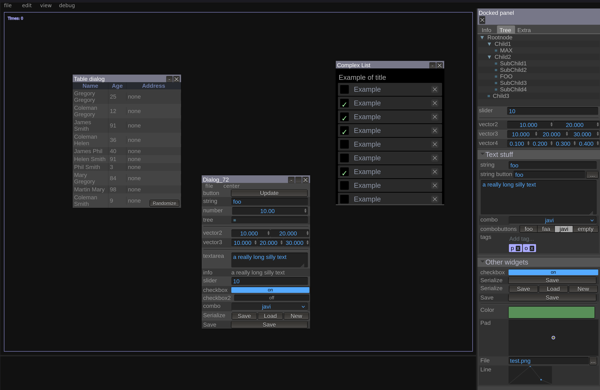

LITEGUI.TS
==========

First of all, I want to credit the original author of [litegui.js](https://github.com/jagenjo/litegui.js), [Javi Agenjo](https://github.com/jagenjo). Even though this is a typescript port of the original library, there are some breaking changes that make it not backwards compatible with the original library.

LiteGUI.ts is a typescript library to create webapps with a desktop look-alike user interface, similar to [imgui](https://github.com/ocornut/imgui). All the widgets, panels,
dialogs, etc are created from code instead of HTML. The upside of this is that this helps to create more dynamic
interfaces and gives a lot of flexibility. The downside is that you'll need to write some code to make it all work. If
you're looking for a library that just needs some HTML and a couple of event handlers to work, litegui is not what
you're looking for. On the other hand, any advanced UI will need a lot of coding and in creating advanced UI's litegui shines.



Creating a UI
-----------

Start with the following index.html:
```html
<!DOCTYPE html>
<html>
<head>
    <title>Algae</title>
    <link type="text/css" rel="stylesheet" href="dist/litegui.css">

    <script type="application/javascript" src="dist/litegui.js"></script>
</head>
<body>
    <script src="init.js"></script>
</body>
</html>
```

Add the following to init.js:
```javascript
// Initialize the library
LiteGUI.init();

// Create a menu bar
var menu = new LiteGUI.Menubar();

// This will create a File menu button with New and Settings listed under it
menu.add('File/New');
menu.add('File/Settings');
// This will be shown greyed out
menu.add('File/I\'m not clickable', { disabled: true });

// Let's add a second main menu button
menu.add('Help/Help');
menu.add('Help/About');

// Add the menu bar to the main container
LiteGUI.add(menu);
```

Now open index.html in your browser. You should see a menu bar on the top of the screen. Right now it's not doing anything when you click on the menu items. Let's add a dialog with interactions so you can see how it works.

Add the following code to init.js after the call to LiteGUI.init():
```javascript
function createSettingsDialog() {
    // Create a new dialog
    var dialog = new LiteGUI.Dialog('Settings', { title:'Settings', close: true, minimize: false, width: 300, height: 500, scroll: false, resizable: false, draggable: true });

    // Create a collection of widgets
    var widgets = new LiteGUI.Inspector();
    var nameWidget = widgets.addString("Your name","foo");
    var ageWidget = widgets.addNumber("Your age", 35, { min: 0, max: 125 });

    dialog.add(widgets);

    // Placeholder function to show the new settings
    function applySettings() {
        console.log("Your name is " + nameWidget.getValue() + ", and you are " + ageWidget.getValue() + " years old");
    }

    // Add some buttons
    dialog.addButton('Ok', { close: true, callback: applySettings });
    dialog.addButton('Apply', { close: false, callback: applySettings });
    dialog.addButton('Cancel',{ close: 'fade' });

    return dialog;
}

var settingsDialog = createSettingsDialog();

// Dialogs are shown on creation, let's hide it until the settings menu item is clicked
settingsDialog.hide();
```

And change the initialization of the menu bar:
```javascript
menu.add('File/Settings', {callback: function() { settingsDialog.show(); } });
```

Now when you click the setting item, you should see a dialog asking about your name and age.

Check the [examples](examples) and [guides](guides) folders for more information.

Special thanks to
----------------
- [Javi Agenjo](https://github.com/jagenjo) for creating the original litegui.js library
- [Pickr](https://github.com/Simonwep/pickr) for the color picker widget
- [Andres Sandoval](https://github.com/Ansaor04) and [Mario Villalvazo](https://github.com/MarioVillalvazo) for the initial conversion to typescript

Final note
----------------
Why did I do this? Coming from a C++ background, I was familiar with ImGui and looking for something similar to create simple interfaces for web games the same as I did with ImGui. I found the original library almost 6 years ago, I still use it, turned it into a typescript library because that's what I was using at the time but it was a private repository. I know that now with LLMs it's easier to create interfaces, but I still find this library useful just to have a reliable tool that it's not meant to see production but it's great for development and testing. I hope that other people find it useful too.


